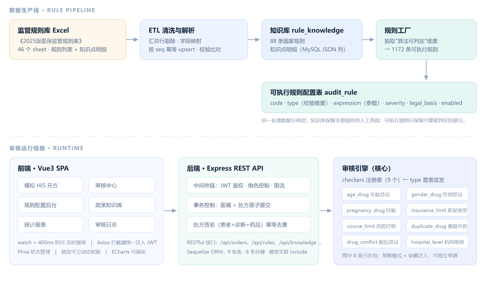
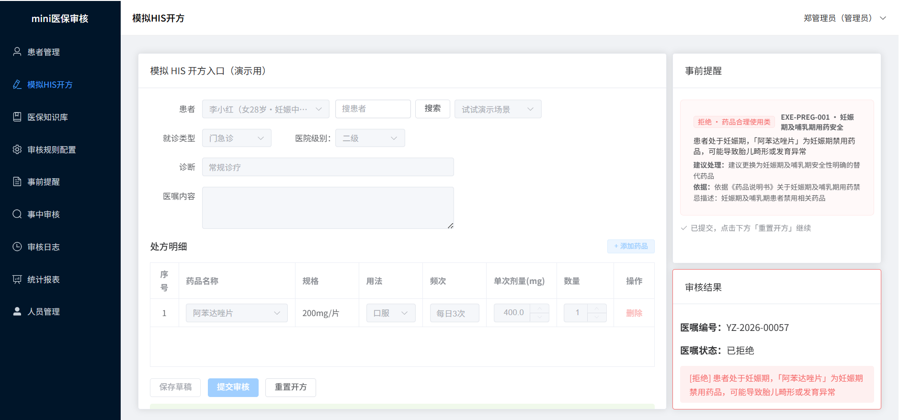
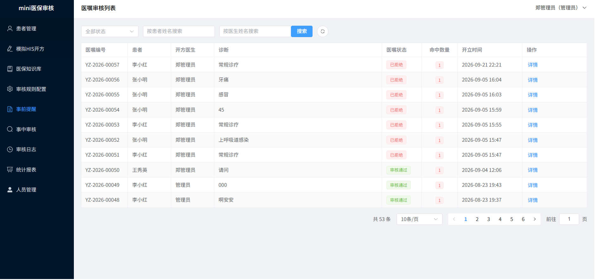
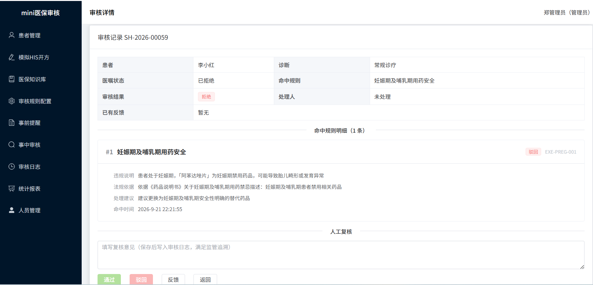
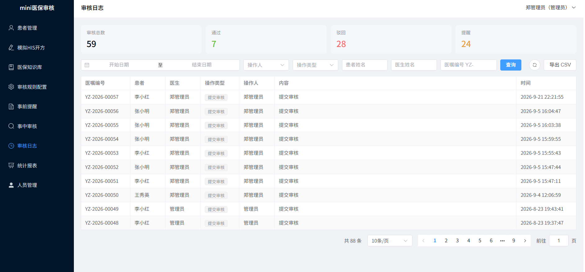
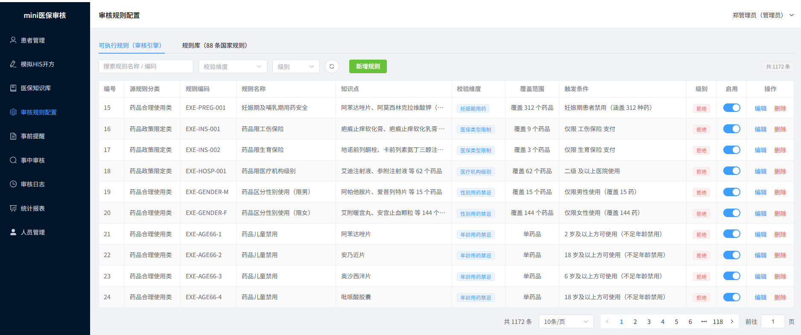
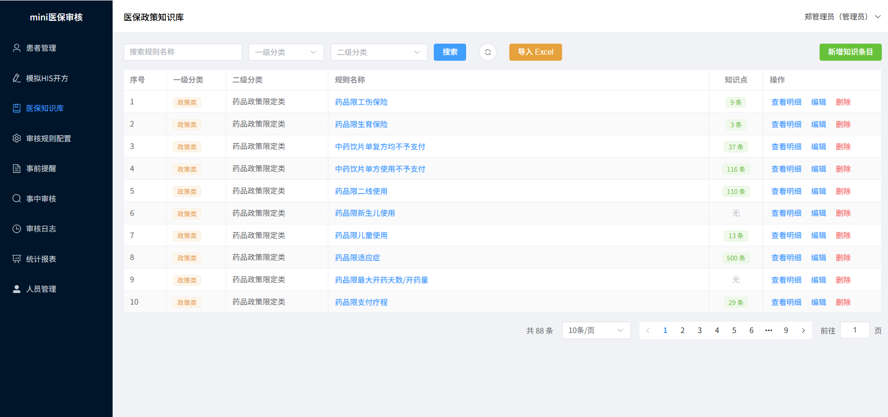
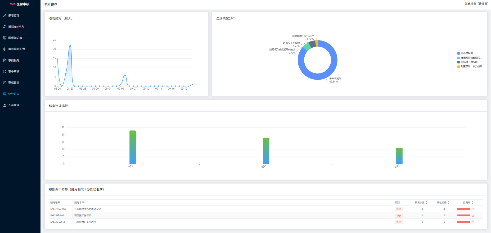

# 医保智能审核系统 · mini-insurance-audit

> **一个模拟真实医保监管场景的智能审核系统**：医生开处方时实时提示违规风险，提交后进入审核队列人工复核，全程操作留痕可追溯。

| | |
|---|---|
| **项目性质** | 独立完成的全栈项目（个人作品） |
| **我的角色** | 从规则数据清洗、数据库设计、前后端开发到容器化部署，全程独立完成 |
| **项目规模** | 前端 9 个页面 · 后端 7 组 REST API · 9 张数据表 · 1172 条可执行规则 |
| **技术栈** | Vue 3 + Element Plus + Pinia ｜ Node.js + Express + Sequelize ｜ MySQL 8 ｜ Docker |
| **工程质量** | 24 个单元测试 · GitHub Actions 持续集成 · 数据库迁移版本化 · Docker 一键启动 |



> 上图上半部分是「规则数据从官方规则库到可执行规则的加工链路」，下半部分是「系统的运行架构」。

---

## 一、这个系统解决什么问题

医保基金监管的核心矛盾是：**监管规则有上千条，人工审核根本看不过来；而违规开方必须在「开方当时」就被拦下，事后追查损失已经造成。**

系统对应三段业务：

| 阶段 | 系统做什么 | 使用角色 |
|---|---|---|
| **事前提醒** | 医生录入处方时**实时校验并提示违规**，给出违规原因、法规依据、修改建议 | 开方医生 |
| **事中审核** | 提交后进入审核队列，审核员逐条复核，作出「通过 / 驳回 / 反馈」决定 | 医保审核员 |
| **事后追溯** | 每一次操作写入审核日志，支持按时间、操作人、患者、医嘱多维筛选与导出 | 监管方 |

---

## 二、核心亮点

| 亮点 | 说明 |
|---|---|
| **真实规则数据，非编造** | 规则来自官方《2025 版医疗保障基金智能监管规则库》，官方**源文件是 PDF**；已自行结构化为 47 个 sheet 的 Excel 后由脚本入库，共 **88 条国家监管规则 + 知识点明细** |
| **把「文字规则」变成「可执行规则」** | 从 88 条规则中自动抽取 **1172 条可执行规则**，覆盖 **8 类校验维度**，每条均可溯源到源表 |
| **规则引擎可扩展** | 规则配置与校验代码完全分离，**新增规则只写配置、不改引擎代码** |
| **规则在线可视化管理** | 1172 条规则支持多维度筛选、逐条启停、编辑删除，支持 Excel 批量导入 |
| **完整的监管闭环** | 事前预审 → 事中复核 → 事后留痕，人工复核意见自动写入审核日志 |
| **工程化完整** | **24 个单元测试** · CI 三道门禁 · migration 版本化建表 · Docker Compose 一键起全套环境 |
| **权限与安全** | 医生 / 审核员双角色；JWT 鉴权 + 路由级权限管控 + 接口限流 + 事务保障数据一致性 |

---

## 三、系统截图

### 1. 事前提醒 —— 医生开方时实时拦截



左侧录入处方，**右侧实时显示违规提示**：命中规则编号、违规原因、处理建议、法规依据。
示例演示：为妊娠期患者开具妊娠期禁用药品，系统当场给出「拒绝」级提示。

### 2. 事前提醒 —— 医嘱审核列表



每张医嘱显示命中规则数量与处理状态，可下钻查看详情。

### 3. 事中审核 —— 复核详情与人工处理



命中规则的完整明细（违规说明 / 法规依据 / 处理建议）+ 人工复核意见，保存后自动写入审核日志，满足监管追溯要求。

### 4. 事后追溯 —— 审核日志



顶部统计（审核总数 / 通过 / 驳回 / 提醒）+ 多维筛选（时间、操作人、操作类型、患者、医生、医嘱编号）+ 一键导出。

### 5. 规则可视化配置 —— 1172 条规则在线管理



支持按规则名称 / 违规分类 / 校验维度 / 级别筛选，逐条启停开关、编辑、删除。

### 6. 医保知识库 —— 88 条国家规则与知识点



保留官方规则原文与知识点明细，供人工查阅；与「可执行规则」分成两层，互不干扰。

### 7. 统计报表



违规趋势、违规类型分布、科室违规排行、规则命中质量四个维度。

---

## 四、技术栈

| 层 | 技术 |
|---|---|
| **前端** | Vue 3 · Vite · Pinia · Vue Router · Element Plus · Axios（统一封装）· ECharts |
| **后端** | Node.js · Express · Sequelize（ORM）· JWT 鉴权 · 角色控制 · 接口限流 |
| **数据库** | MySQL 8 · sequelize-cli migration（版本化建表、可回滚） |
| **数据加工** | 官方 PDF 提取 + 结构化整理为多 sheet Excel → 脚本 ETL（解析 → 清洗去重 → 幂等入库 → 一致性校验） |
| **工程化** | vitest（单元测试）· GitHub Actions（CI）· Docker / Docker Compose |

---

## 五、技术设计说明

> 这一节给技术面试官：说明关键设计**为什么这么做**，而不只是做了什么。

### 1. 规则引擎：策略模式 + `type` 查表派发

规则配置（`audit_rule` 表）与校验逻辑（`checkers` 注册表）分离，用 `type` 字段桥接。

```js
// backend/src/services/auditEngine.js
const checkers = {
  drug_conflict(order, expr) { /* 配伍禁忌 */ },
  gender_drug(order, expr)   { /* 性别用药禁忌 */ },
  dose(order, expr)          { /* 剂量超标 */ },
  // ...共 9 个 checker 注册
}

async function auditByOrder(order, rules) {
  if (!rules) rules = await fetchEnabledRules()
  // 防御性排序：命中结果按 priority 降序，不依赖调用方 / DB 已排序
  rules = [...rules].sort((a, b) => (b.priority ?? 0) - (a.priority ?? 0) || (a.id ?? 0) - (b.id ?? 0))

  const violations = []
  for (const rule of rules) {
    const expr = typeof rule.expression === 'string' ? JSON.parse(rule.expression) : rule.expression
    const checker = checkers[rule.type]        // ★ 查表派发
    if (!checker) continue
    let result = null
    try { result = await checker(order, expr, {}) } catch { continue }
    if (result) {
      violations.push({ rule_id: rule.id, rule_code: rule.code, severity: rule.severity,
                        reason: result.reason, legal_basis: rule.legal_basis, priority: rule.priority })
    }
  }
  return { violations, checked: rules.length }
}
```

**为什么不用 `if / else if` 堆校验分支？**
1172 条规则对应 8 类校验维度。若写成分支判断，规则数量一涨函数就被撑爆，且每加一类校验都要改主流程。改成注册表后：**新增一类校验 = 注册一个函数；新增一条规则 = 配置一行数据**，主流程零改动。同时每个 checker 是纯函数、依赖可注入，可以直接单测。

**另一处取舍：** checker 抛错时 `continue` 而不是整体失败——单条规则配置有问题，不应该让整次审核中断。

### 2. 88 条规则 → 1172 条可执行规则：抽取标准

官方规则库里大多数是**临床描述**（如"某类患者慎用某药"），不能直接编程执行。抽取标准是：**只提取「算法可判定」的维度**——条件能用结构化字段表达、结论能落成规则的部分。

| 可以抽取（算法可判定） | 不抽取（需人工临床判断） |
|---|---|
| 性别、年龄、妊娠状态、医保类型、医疗机构级别、用药疗程、重复开药、配伍禁忌 | 临床综合评估、病情严重程度、个体化用药调整 |

抽取结果同时做一致性校验（`backend/scripts/verify-executable-rules.js`）：`type` 合法 / `code` 唯一 / 分类与源表一致 / 药名真实存在于源知识点。

知识库与可执行规则**分成两层数据**：`rule_knowledge` 保留全部 88 条规则供人工查阅，`audit_rule` 只保留引擎能判定的 1172 条。

### 3. 事前提醒：为什么「防抖 + 不落库 + 不改状态」

```js
// frontend/src/views/OrderCreate.vue
// 事前提醒：处方变化时实时预审（防抖 400ms，不落库不改状态）
let precheckTimer = null
async function runPrecheck() {
  clearTimeout(precheckTimer)
  precheckTimer = setTimeout(async () => {
    const rows = form.prescriptions.filter(p => p.drug_id)
    if (rows.length === 0) { precheckResults.value = []; return }
    const data = await orderApi.precheck({ patient_id: form.patient_id, prescriptions: rows,
                                           visit_type: form.visit_type, hospital_level: form.hospital_level })
    precheckResults.value = data.violations || []
  }, 400)
}
watch(() => form.prescriptions, runPrecheck, { deep: true })
// 患者 / 就诊类型 / 医院级别变化同样触发预审（修改场景条件后提示应实时刷新）
watch([() => form.patient_id, () => form.visit_type, () => form.hospital_level], runPrecheck)
```

- **为什么单独一个 `POST /api/orders/precheck` 接口？** 预审要返回富结构（规则名 / 级别 / 法规依据 / 建议）才能渲染右侧提示，而落库的审核接口只需返回状态。拆开接口，预审才有足够信息。
- **为什么预审不落库、不改状态？** 医生开方过程中会反复改动处方，若每次预审都写库，会产生大量无意义的中间记录、污染审核队列。预审**只计算、不持久化**。
- **为什么防抖 400ms？** 医生是连续改剂量、连续加药的操作节奏。防抖把一串连续改动合并成一次请求，既避免请求风暴，又保证"改完立刻看到结果"。处方、患者、就诊类型、医院级别四个维度一起 watch，任一变化都刷新。

### 4. 幂等与数据一致性

- **幂等防重复**：用药嘱签名（患者 + 诊断 + 药品）作为幂等键，配合 **5 分钟重查窗口**，窗口内相同签名直接复用已有结果，避免重复审核记录。
- **事务控制**：医嘱与处方明细在同一事务内原子提交，避免出现「医嘱已建、药品明细缺失」的中间态。
- **外键约束**：9 张表、8 条外键，保证关联数据不会出现孤儿记录。

### 5. 前端鉴权与权限：两层约定

```js
// frontend/src/api/request.js —— 请求拦截器自动注入 token
request.interceptors.request.use(config => {
  const userStore = useUserStore()
  if (userStore.token) config.headers.Authorization = `Bearer ${userStore.token}`
  return config
})
// 响应拦截器：401 统一登出跳登录；403 提示无权限；业务 code !== 0 统一报错
// 并直接返回 data.data，页面无需再包一层
```

```js
// frontend/src/router/index.js —— 路由级权限管控
router.beforeEach((to, from, next) => {
  const userStore = useUserStore()
  if (to.meta.public) return next()
  if (!userStore.token) return next('/login')
  if (to.meta.roles && !to.meta.roles.includes(userStore.role)) return next('/patients')
  next()
})
```

- **接口层**：axios 拦截器统一注入 token、统一处理 401/403 与业务错误码
- **路由层**：`meta.roles` 声明式声明权限，守卫统一校验；未登录跳登录，角色不匹配跳安全页

### 6. 工程化

| 项 | 内容 |
|---|---|
| 单元测试 | vitest 24 个用例：各 checker 边界逻辑 + 聚合排序 + 依赖注入可测性 |
| 数据库迁移 | sequelize-cli migration 版本化建表，可回滚、可多人协作 |
| 持续集成 | GitHub Actions 每次 push 跑**三道门禁**：后端单测 / 前端构建 / 真实 MySQL 容器执行迁移 |
| 一键部署 | Docker Compose 编排 MySQL + 后端 + 前端，一条命令起全套环境 |

---

## 六、快速开始

### 方式 A：Docker 一键启动（推荐，无需本机装 MySQL / Node）

1. 安装 [Docker Desktop](https://www.docker.com/products/docker-desktop/) 并启动
2. 准备环境变量：
   ```bash
   cp backend/.env.example backend/.env
   # 编辑 backend/.env：修改 DB_PASS 与 JWT_SECRET（至少 32 位随机串）
   ```
3. 启动（首次自动构建镜像 + 建表 + 灌种子数据，需几分钟）：
   ```bash
   docker compose up -d
   ```
4. 浏览器访问 **http://localhost:8080**

### 方式 B：本地开发模式

```bash
# 后端（需本地 MySQL 8，自动执行 migration 建表）
cd backend
npm install
npm run migrate    # 建表
npm run seed       # 灌种子数据（88 条知识库 + 1172 条可执行规则）
npm run dev        # http://localhost:3000

# 前端
cd frontend
npm install
npm run dev        # http://localhost:5173（/api 自动代理到 3000）
```

> **演示账号**：`dr_wang / 123456`（医生）｜ `admin_zheng / 123456`（管理员）
>
> **演示患者**：张小明（男 8 岁）、李小红（女 28 岁·妊娠）、张大壮（男 65 岁）、王秀英（女 70 岁）——覆盖性别 / 年龄 / 妊娠禁忌场景

---

## 七、环境变量说明

复制 `backend/.env.example → backend/.env` 后填写：

| 变量 | 说明 |
|---|---|
| `DB_HOST / DB_PORT / DB_NAME / DB_USER / DB_PASS` | 数据库连接（Docker 部署时 compose 自动覆盖 `DB_HOST=db`） |
| `JWT_SECRET` | 登录签名密钥，**必须改成随机长串**（勿用示例值） |
| `CORS_ORIGIN` | 允许跨域的前端来源（本地开发 5173；Docker 前端 8080） |

---

## 八、规则数据怎么来的（数据溯源）

```
官方 PDF《2025 年版医疗保障基金智能监管规则库、知识库》（非结构化文档，规则框架约 50 页）
        ↓ ① Extract：借助 pdfplumber 定位提取 + 人工结构化整理为 Excel
结构化 Excel（47 个 sheet）
   ├─ 第 1 个 sheet：88 条规则列表（分类 / 规则名 / 是否有明细）
   └─ 其余 46 个 sheet：每条规则的知识点明细（按"规则名 ∈ sheet 名"匹配）
        ↓ ② Transform + Load：脚本 ETL（解析 → 清洗去重 → 幂等 upsert → 校验比对）
rule-library.json（backend/data）
   ├─ migrate-rule-knowledge.js → rule_knowledge 表（88 条 + 知识点，供人工查阅）
   └─ executableRuleFactory.js  → audit_rule 表（1172 条可执行规则，仅"算法可判定"维度）
        ↓ 引擎执行
auditEngine.js：按 type 找到对应 checker → 逐条跑校验 → 生成富结构违规记录
```

> **ETL 各阶段说明**：官方只提供非结构化的 PDF，所以 **Extract 阶段是「借助 pdfplumber 定位提取 + 人工结构化整理」配合完成的**；Transform（清洗去重、字段映射、幂等 upsert、一致性校验）与 Load（入库）全部由脚本自动完成。

- 一致性校验脚本：`node backend/scripts/verify-executable-rules.js`
- 后台批量导入：解析逻辑见 `backend/src/services/ruleLibraryParser.js`

---

## 九、测试与 CI

```bash
cd backend && npm test        # vitest：24 个用例
```

CI（`.github/workflows/ci.yml`）每次 push / PR 自动执行三道门禁：

1. `backend-test` —— 后端单元测试（无需 DB）
2. `frontend-build` —— 前端打包
3. `migration-check` —— 用真实 MySQL 容器执行 `db:migrate`，验证迁移可建表

---

## 十、目录结构

```
├─ docs/                       # README 截图与架构图
├─ docker-compose.yml          # 一键编排 mysql + backend + frontend
├─ .github/workflows/ci.yml    # CI 三道门禁
├─ backend/
│  ├─ src/
│  │  ├─ services/auditEngine.js            # 规则引擎（checkers 注册表 + type 派发）
│  │  ├─ services/executableRuleFactory.js  # 真实规则自动抽取
│  │  ├─ services/ruleLibraryParser.js      # Excel 批量导入解析
│  │  ├─ routes/                            # 7 组 REST API
│  │  ├─ models/                            # Sequelize 模型（9 张表）
│  │  ├─ middlewares/                       # 鉴权 / 角色 / 错误处理
│  │  ├─ seeders/seed.js                    # 种子数据
│  │  └─ app.js
│  ├─ migrations/                           # sequelize-cli 迁移（版本化建表）
│  ├─ scripts/                              # 导入 / 校验 / 清理脚本
│  ├─ data/rule-library.json                # 88 条规则源数据
│  └─ Dockerfile / .env.example
└─ frontend/
   ├─ src/
   │  ├─ views/                             # 9 个页面
   │  ├─ api/request.js                     # axios 统一封装（拦截器 + JWT 注入）
   │  ├─ router/index.js                    # 路由守卫 + meta.roles 权限
   │  └─ store/                             # Pinia 状态管理
   └─ Dockerfile / nginx.conf
```

---

## 十一、免责声明

学习 / 演示项目。规则来源于公开的《2025 版医疗保障基金智能监管规则库》，仅用于技术演示，**不构成任何医疗或医保审核结论**。
